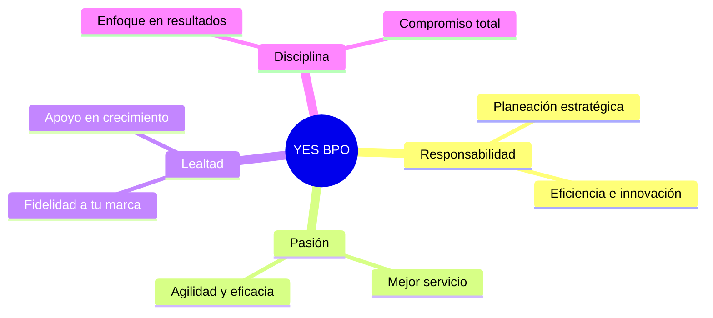

<div align="center">

<!-- Banner/Logo al inicio -->
<p align="center">
  
</p>

# 💼 Yes Contact & BPO SAS

### *La conexión perfecta entre tecnología y personas*

[](https://yesbpo.com)
[](https://co.linkedin.com/company/yes-bpo-s-a-s)
[](https://www.instagram.com/yesbpo/)
[](https://www.facebook.com/yesbpo.co)

```ascii
╔══════════════════════════════════════════════════════════════╗
║  🚀  10+ años transformando la comunicación empresarial     ║
║  🌟  Líderes en soluciones B2B personalizadas               ║
║  💡  Pioneros en YES BPO 4.0                                 ║
╚══════════════════════════════════════════════════════════════╝
```

</div>

---

## 🎯 Sobre Nosotros

**Yes Contact & BPO SAS** es mucho más que un call center: somos tu **aliado estratégico** en la transformación digital de la comunicación empresarial. Con más de una década de experiencia, nos especializamos en crear **soluciones innovadoras y personalizadas** que impulsan el crecimiento de tu negocio.

### 🏆 Nuestra Misión

Liderar la transformación de soluciones personalizadas e innovadoras mediante servicios B2B de última generación, evolucionando constantemente los estándares de calidad y generando un **impacto real** en las necesidades de cada cliente.

### 🔮 Nuestra Visión 2030

Ser la empresa líder a nivel nacional, reconocida por:
- ✨ Servicios de **alta calidad** e innovación constante
- 🔐 Seguridad y acompañamiento integral
- 🚀 Excelencia en contact center, gestión tecnológica y marketing digital

---

## 💎 Pilares Fundamentales

<table>
<tr>
<td width="50%">

### 🎯 Nuestros Valores



</td>
<td width="50%">

### ⭐ Lo que nos Distingue

- **🙏 Agradecimiento**: 10 años de confianza con las mejores empresas del país
- **🤝 Acompañamiento**: Desde la primera conversación hasta el éxito final
- **💡 Innovación**: YES BPO 4.0 - Tecnología de vanguardia
- **🎨 Creatividad**: Soluciones únicas que generan valor agregado

</td>
</tr>
</table>

---

## 📊 Nuestra Historia

```
2010 ━━━━━━━━━━━━━━━━━━━━━━━━━━━━━━━━━━━━━━━━ 2025
 │                    │                        │
 ├─ 🎬 Inicio         ├─ 🔄 Evolución         ├─ 🚀 Líder Nacional
 │  Telemercadeo      │  Servicios B2B        │  YES BPO 4.0
 │                    │                        │
2010-2013            2016                     2025
Portafolio &         Actualización            Mayor crecimiento
Cobranzas            estratégica              del sector
```

**Hitos Clave:**
- 📞 **2010**: Nacimiento como call center especializado
- 💼 **2011-2013**: Primeros clientes en recuperación de cartera
- 🔧 **2016**: Transformación y enfoque en soluciones personalizadas
- 🏆 **2025**: Referentes en innovación B2B

---

## 🛠️ Portafolio de Servicios

<div align="center">

### 🎯 Soluciones Principales

</div>

| Categoría | Servicios |
|-----------|-----------|
| 📞 **Contact Center** | Call Center · SAC · Atención al Cliente · Soporte Técnico |
| 💰 **Gestión Financiera** | Cobranza · Recuperación de Cartera · Prevención de Mora |
| 🎨 **Marketing Digital** | Estrategias Digitales · Social Media · Campañas 360° |
| 💻 **Desarrollo Tech** | Soluciones a Medida · Integración de Sistemas · APIs |
| 📱 **Comunicación Masiva** | SMS · SMS 2-way · SMS to Call · IVR · Voz · Email · WhatsApp |

<details>
<summary><b>🔍 Ver más detalles de servicios</b></summary>

### Comunicación Omnicanal

- **SMS Tradicional**: Envío masivo de mensajes de texto
- **SMS 2-way**: Comunicación bidireccional en tiempo real
- **SMS to Call**: Conversión automática de SMS a llamadas
- **IVR**: Sistemas de respuesta de voz interactiva
- **Email Marketing**: Campañas automatizadas y personalizadas
- **WhatsApp Business**: Atención y ventas por WhatsApp

### Tecnología Avanzada

- Integración con CRMs
- Análisis de datos en tiempo real
- IA y automatización
- Reporting y dashboards personalizados

</details>

---

## 🌟 ¿Por qué elegirnos?

<div align="center">

| 🎯 Experiencia | 💡 Innovación | 🤝 Compromiso | 📈 Resultados |
|:-------------:|:-------------:|:-------------:|:-------------:|
| +10 años | BPO 4.0 | 24/7 | ROI comprobado |
| Líderes del sector | Tecnología de punta | Acompañamiento total | Satisfacción +95% |

</div>

> **"No somos solo un proveedor, somos tu socio estratégico en el camino hacia el éxito"**

---

## 📍 Ubicación & Contacto

<div align="center">

### 🏢 Oficinas Principales

**📍 Dirección**: Calle 124 #45-15, Bogotá D.C., Colombia

### 📞 Canales de Contacto

| Canal | Información |
|:-----:|:------------|
| 🌐 | **Web**: [yesbpo.com](https://yesbpo.com) |
| ✉️ | **Email**: comercial@yesbpo.co |
| 📱 | **Teléfono**: +57 310 816 7555 |
| 💼 | **LinkedIn**: [Yes BPO S.A.S](https://co.linkedin.com/company/yes-bpo-s-a-s) |
| 📸 | **Instagram**: [@yesbpo](https://www.instagram.com/yesbpo/) |
| 👥 | **Facebook**: [YesBPO.co](https://www.facebook.com/yesbpo.co) |

</div>

---

## 🚀 ¿Listo para transformar tu negocio?

<div align="center">

### Contáctanos hoy y descubre cómo podemos ayudarte

[](mailto:comercial@yesbpo.co)
[](https://wa.me/573108167555)

</div>

---

<div align="center">

### 🌟 Siguenos en Nuestras Redes

[](https://co.linkedin.com/company/yes-bpo-s-a-s)
[](https://www.instagram.com/yesbpo/)
[](https://www.facebook.com/yesbpo.co)
[](https://yesbpo.com)

---

**© 2025 Yes Contact & BPO SAS** · Todos los derechos reservados · *Hecho con* ❤️ *en Colombia*

```
┌─────────────────────────────────────────────────────────┐
│  "La conexión perfecta para tu negocio"                 │
│  YES BPO - Innovación · Calidad · Compromiso            │
└─────────────────────────────────────────────────────────┘
```

</div>
